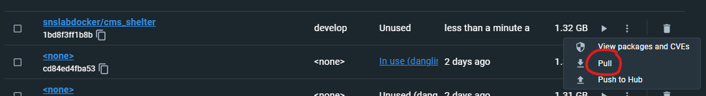
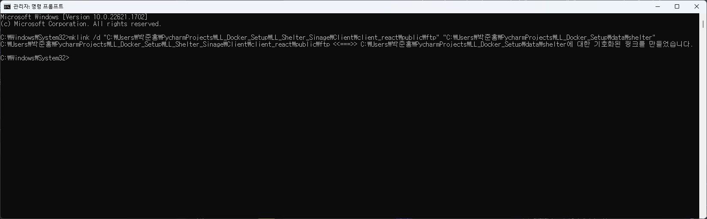
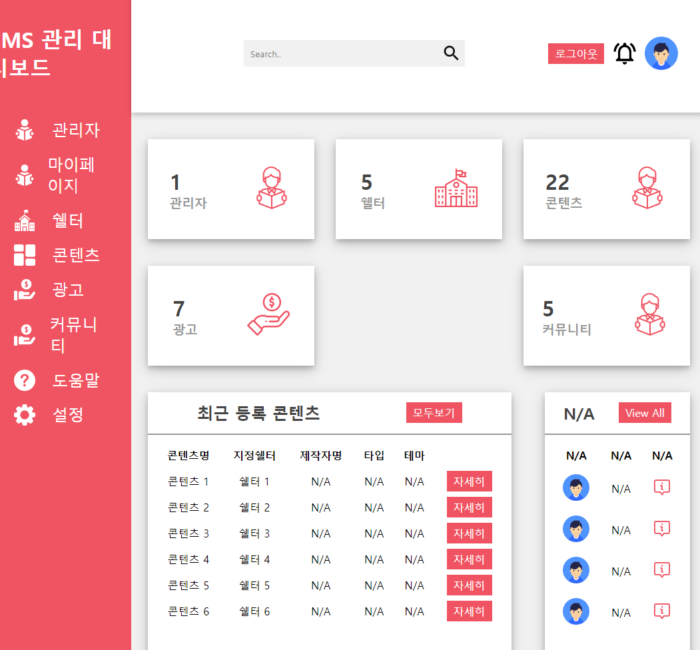
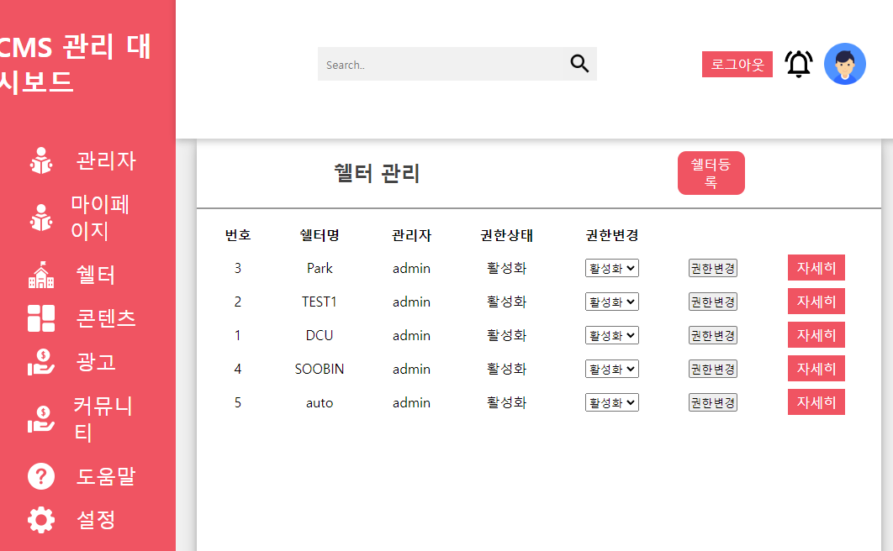
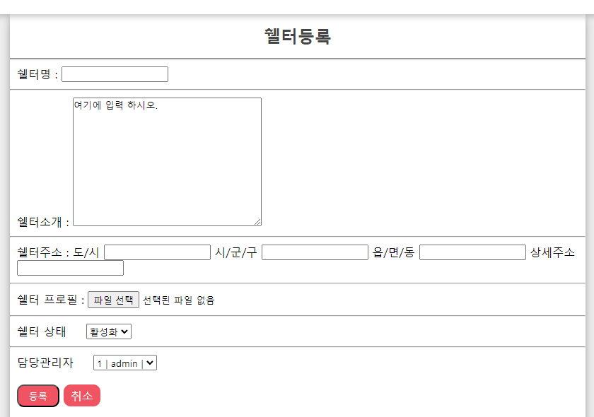
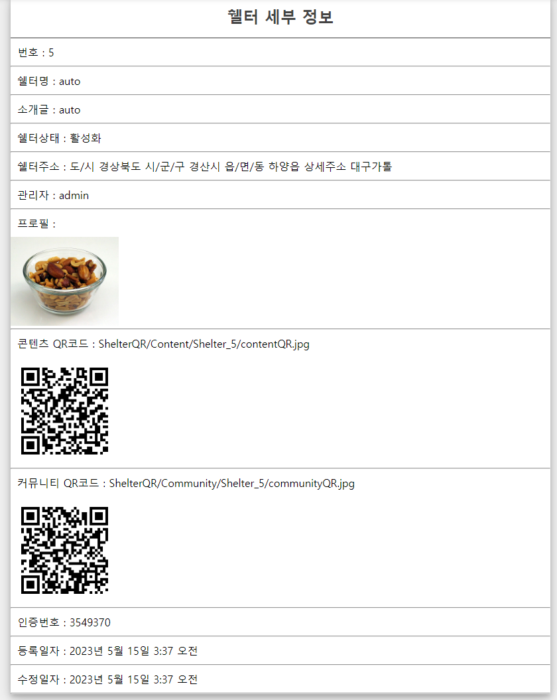
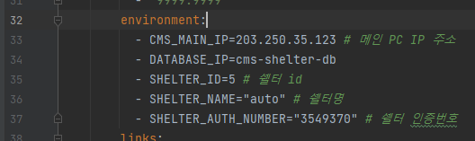

# 리빙랩 개발 환경 구성

## 필요 소프트웨어

- Docker
- Docker-compose

## 저장소 Clone

2023 05 17

진행에 앞서 LL_Docker_Setup, LL_Shelter_Signage 저장소의 내용이 변경되었으니

기존 저장소 삭제 후 다시 clone 받은 후 아래 내용들 진행하기 바랍니다.

구성에 필요한 docker image 또한 변경되었으니 아래 이미지처럼 새 이미지 Pull 이후 진행



---

본 저장소(LL_Docker_Setup) Clone 후 LL_Docker_Setup 경로에서 아래 명령어 수행

```bash
git clone https://github.com/DCUSnSLab/LL_Shelter_Sinage.git
```

이후 LL_Shelter_Sinage 프로젝트의 Client/client_react/public/ftp 경로와
LL_Docker_Setup 프로젝트의 data/shelter 경로를 대상으로 심볼릭 링크를 생성한다.

> 윈도우 사용 시 (관리자 권한 명령 프롬프트로 진행)
```
mklink /d "(인원 별 개인 환경)\LL_Docker_Setup\LL_Shelter_Sinage\Client\client_react\public\ftp" "(인원 별 개인 환경)\LL_Docker_Setup\data\shelter"
```

> 실행 결과


IDLE 페이지 작업은 위에서 clone한 저장소를 기준으로 진행한다.

## CMS를 통한 Main 서버 쉘터 생성

아래 주소를 통해 Main 서버에 접속한다.

[Main Server](http://203.250.35.123:8000/Login/)

이후 아래 계정으로 로그인을 진행한다.

- id
  - admin
- pw
  - 20121208



대시보드 왼쪽 메뉴에서 ```쉘터``` 메뉴를 클릭한다.



이후 ```쉘터 등록``` 버튼을 클릭하여 새 쉘터를 생성한다.



임의의 쉘터명, 소개, 주소, 프로필 이미지 파일 입력 후 등록 버튼을 클릭한다.

## docker-compose 내용 수정 및 빌드



생성된 쉘터의 번호, 쉘터명, 인증번호를

docker-compose_shelter.yml 파일의 아래 항목에 입력한다.



docker-compose_shelter.yml 파일이 있는 경로에서 아래 명령어를 통해 compose를 수행한다.

```bash
docker-compose -f docker-compose_shelter.yml up -d
```

## 인원 별 저장소 및 개발 내용

Jira의 각 티켓 참고해서 아래 저장소 기반 작업 진행하면 될 것 같습니다.

본인 쉘터에 컨텐츠 업로드를 위해서는 아래 URL 패턴 마지막 숫자를 본인의 id로 변경하여 진행
- http://203.250.35.123:8000/Userservice/UploadContent/1
- http://203.250.35.123:8000/Userservice/AddCommunityComment/1


- Main
  - Contents upload UI (노동원, 환경구축 과정이 위와 다르므로 별도 진행)
    - 저장소 및 작업 경로
      - https://github.com/DCUSnSLab/LL_Main
      - https://github.com/DCUSnSLab/LL_Main/tree/Main/Livinglab_CMS/Livinglab/Livinglab-CMS/cms_main_server/templates/Userservice


- Shelter
  - Client
    - Sinage IDLE 페이지 (박보은)
      - 저장소 및 작업 경로
        - https://github.com/DCUSnSLab/LL_Shelter_Sinage
        - https://github.com/DCUSnSLab/LL_Shelter_Sinage/tree/IDLE_2/Client/client_react/src/component
    - Sinage Contents 리스트 페이지 (김경연)
      - 저장소 및 작업 경로
        - https://github.com/DCUSnSLab/LL_Shelter_Sinage
        - https://github.com/DCUSnSLab/LL_Shelter_Sinage/blob/IDLE_2/Client/client_react/src/component/SignageShow.js
    - MediaPlayer (문지원)
    - Community (임찬아)
      - 저장소 및 작업 경로
        - https://github.com/DCUSnSLab/LL_Shelter_Sinage
        - https://github.com/DCUSnSLab/LL_Shelter_Sinage/blob/IDLE_2/Client/client_react/src/component/IssueBoard.js
  - Server
    - API-Server (박준홍)